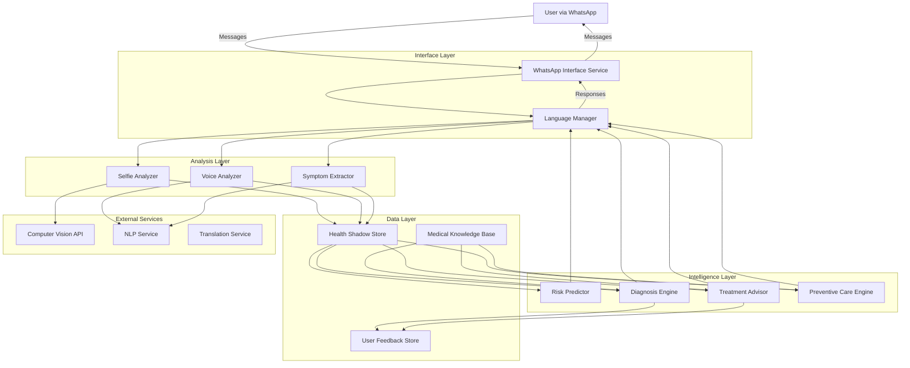

# Design Document: AI BioTwin Health Companion

## Overview

The AI BioTwin Health Companion is a WhatsApp-based digital health platform that creates personalized health profiles through multi-modal input analysis. The system architecture follows a microservices pattern with specialized components for computer vision, natural language processing, predictive analytics, and treatment recommendation.

The design emphasizes:
- **Accessibility**: WhatsApp-first interface requiring no app installation
- **Personalization**: Continuous learning from user interactions to build accurate health shadows
- **Localization**: Multi-language support with culturally appropriate medical guidance
- **Privacy**: End-to-end encryption and strict data protection
- **Scalability**: Distributed architecture to handle millions of concurrent users
- **Cost-effectiveness**: Optimized for low-resource environments

## Architecture

### High-Level Architecture



### Component Interaction Flow

1. **Input Processing**: User sends message → WhatsApp Interface → Language Manager → Appropriate Analyzer
2. **Analysis**: Analyzer processes input → Extracts health data → Updates Health Shadow
3. **Intelligence**: Health Shadow triggers → Risk Predictor/Diagnosis Engine/Treatment Advisor
4. **Response Generation**: Intelligence components → Language Manager → WhatsApp Interface → User

### Deployment Architecture

- **Cloud Infrastructure**: AWS/Azure with multi-region deployment for low latency
- **Container Orchestration**: Kubernetes for service management and auto-scaling
- **Message Queue**: RabbitMQ/Kafka for asynchronous processing
- **Database**: PostgreSQL for structured data, MongoDB for Health Shadow documents
- **Cache**: Redis for session management and frequently accessed data
- **CDN**: CloudFront for serving static medical content

## Components and Interfaces

### 1. WhatsApp Interface Service

**Responsibility**: Manages all communication with WhatsApp Business API

**Interface**:
```typescript
interface WhatsAppInterface {
  // Receive incoming messages
  receiveMessage(webhookPayload: WebhookPayload): Promise<void>
  
  // Send text responses
  sendTextMessage(userId: string, message: string, language: Language): Promise<MessageStatus>
  
  // Send interactive buttons
  sendInteractiveButtons(userId: string, text: string, buttons: Button[], language: Language): Promise<MessageStatus>
  
  // Download media (images, voice notes)
  downloadMedia(mediaId: string): Promise<MediaFile>
  
  // Send media responses
  sendMediaMessage(userId: string, mediaUrl: string, caption: string): Promise<MessageStatus>
  
  // Manage conversation context
  getConversationContext(userId: string): Promise<ConversationContext>
  updateConversationContext(userId: string, context: ConversationContext): Promise<void>
}

type WebhookPayload = {
  from: string
  messageId: string
  timestamp: number
  type: 'text' | 'image' | 'audio' | 'interactive'
  content: string | MediaReference
}

type MessageStatus = {
  success: boolean
  messageId: string
  error?: string
}

type ConversationContext = {
  userId: string
  currentFlow: 'onboarding' | 'symptom_check' | 'lifestyle_update' | 'general'
  lastInteraction: Date
  pendingQuestions: string[]
  collectedData: Record<string, any>
}
```

**Key Behaviors**:
- Webhook validation for security
- Rate limiting per user
- Message queuing for high load
- Automatic retry on delivery failures
- Context persistence across sessions

### 2. Language Manager

**Responsibility**: Handles all language translation and localization

**Interface**:
```typescript
interface LanguageManager {
  // Translate text to user's preferred language
  translate(text: string, targetLanguage: Language): Promise<string>
  
  // Detect language from text
  detectLanguage(text: string): Promise<Language>
  
  // Get localized medical terminology
  getMedicalTerm(englishTerm: string, targetLanguage: Language): Promise<LocalizedTerm>
  
  // Format response with cultural context
  formatResponse(template: ResponseTemplate, data: any, language: Language): Promise<string>
}

type Language = 'en' | 'hi' | 'bn' | 'te' | 'mr' | 'ta' | 'gu' | 'ur' | 'kn' | 'ml' | 'pa'

type LocalizedTerm = {
  localTerm: string
  englishTerm: string
  pronunciation?: string
}

type ResponseTemplate = {
  templateId: string
  placeholders: string[]
  culturalNotes?: string
}
```

**Key Behaviors**:
- Caching of common translations
- Fallback to English if translation unavailable
- Medical terminology consistency
- Cultural sensitivity in phrasing

### 3. Selfie Analyzer

**Responsibility**: Processes facial images to extract health indicators

**Interface**:
```typescript
interface SelfieAnalyzer {
  // Analyze selfie for health indicators
  analyzeImage(imageData: Buffer, userId: string): Promise<HealthIndicators>
  
  // Validate image quality
  validateImageQuality(imageData: Buffer): Promise<QualityCheck>
  
  // Extract specific features
  detectSkinConditions(imageData: Buffer): Promise<SkinAnalysis>
  detectEyeConditions(imageData: Buffer): Promise<EyeAnalysis>
  detectFacialPallor(imageData: Buffer): Promise<PallorAnalysis>
  detectJaundice(imageData: Buffer): Promise<JaundiceAnalysis>
}

type HealthIndicators = {
  skinConditions: SkinAnalysis
  eyeConditions: EyeAnalysis
  facialPallor: PallorAnalysis
  jaundiceIndicators: JaundiceAnalysis
  overallConfidence: number
  timestamp: Date
}

type QualityCheck = {
  isAcceptable: boolean
  issues: ('blurry' | 'poor_lighting' | 'face_not_detected' | 'too_far' | 'too_close')[]
  suggestions: string[]
}

type SkinAnalysis = {
  conditions: Array<{
    condition: string
    confidence: number
    location: BoundingBox
    severity: 'mild' | 'moderate' | 'severe'
  }>
}

type EyeAnalysis = {
  redness: number
  yellowness: number
  puffiness: number
  darkCircles: number
}

type PallorAnalysis = {
  pallorLevel: number
  anemiaRisk: 'low' | 'medium' | 'high'
}

type JaundiceAnalysis = {
  scleralIcterus: boolean
  skinYellowing: number
  jaundiceRisk: 'low' | 'medium' | 'high'
}
```

**Key Behaviors**:
- Pre-processing: face detection, alignment, normalization
- Multi-model ensemble for robust detection
- Confidence thresholding before reporting
- Privacy: no face recognition, only health indicators
- Image retention policy: 30 days then deletion

### 4. Voice Analyzer

**Responsibility**: Transcribes and analyzes voice notes for symptom extraction

**Interface**:
```typescript
interface VoiceAnalyzer {
  // Transcribe voice note
  transcribeAudio(audioData: Buffer, language: Language): Promise<Transcription>
  
  // Extract symptoms from transcription
  extractSymptoms(transcription: string, language: Language): Promise<SymptomData>
  
  // Analyze voice characteristics (optional)
  analyzeVoiceCharacteristics(audioData: Buffer): Promise<VoiceCharacteristics>
}

type Transcription = {
  text: string
  confidence: number
  language: Language
  duration: number
}

type SymptomData = {
  symptoms: Array<{
    symptom: string
    severity: 'mild' | 'moderate' | 'severe'
    duration: string
    frequency: string
    confidence: number
  }>
  bodyParts: string[]
  temporalInfo: {
    onset: string
    progression: 'improving' | 'stable' | 'worsening'
  }
  associatedFactors: string[]
}

type VoiceCharacteristics = {
  hoarseness: number
  breathlessness: number
  coughDetected: boolean
  energyLevel: 'low' | 'normal' | 'high'
}
```

**Key Behaviors**:
- Multi-language speech recognition
- Medical terminology recognition
- Context-aware symptom extraction
- Clarification question generation
- Audio retention policy: immediate deletion after transcription

### 5. Health Shadow Store

**Responsibility**: Manages persistent storage and retrieval of user health profiles

**Interface**:
```typescript
interface HealthShadowStore {
  // Create new health profile
  createProfile(userId: string, initialData: ProfileData): Promise<HealthShadow>
  
  // Retrieve health profile
  getProfile(userId: string): Promise<HealthShadow>
  
  // Update health profile
  updateProfile(userId: string, updates: Partial<HealthShadow>): Promise<HealthShadow>
  
  // Add health event
  addHealthEvent(userId: string, event: HealthEvent): Promise<void>
  
  // Get health history
  getHealthHistory(userId: string, timeRange: TimeRange): Promise<HealthEvent[]>
  
  // Delete profile (GDPR compliance)
  deleteProfile(userId: string): Promise<void>
}

type HealthShadow = {
  userId: string
  demographics: {
    age: number
    gender: 'male' | 'female' | 'other'
    location: Location
  }
  preferences: {
    language: Language
    notificationSettings: NotificationPreferences
  }
  healthHistory: HealthEvent[]
  currentConditions: Condition[]
  medications: Medication[]
  allergies: string[]
  lifestyle: LifestyleData
  riskScores: RiskScores
  lastUpdated: Date
  createdAt: Date
}

type HealthEvent = {
  eventId: string
  timestamp: Date
  type: 'symptom' | 'diagnosis' | 'treatment' | 'lifestyle_change' | 'image_analysis' | 'voice_analysis'
  data: any
  source: 'user_input' | 'system_analysis' | 'external'
}

type LifestyleData = {
  diet: {
    type: 'vegetarian' | 'non_vegetarian' | 'vegan'
    mealsPerDay: number
    waterIntake: number
  }
  exercise: {
    frequency: number
    type: string[]
    duration: number
  }
  sleep: {
    averageHours: number
    quality: 'poor' | 'fair' | 'good'
  }
  habits: {
    smoking: boolean
    alcohol: boolean
    tobacco: boolean
  }
}

type RiskScores = {
  diabetes: number
  hypertension: number
  cardiovascular: number
  respiratory: number
  lastCalculated: Date
}
```

**Key Behaviors**:
- Encryption at rest (AES-256)
- Versioning for audit trail
- Automatic backup every 24 hours
- Data retention: indefinite unless user requests deletion
- Access logging for security

### 6. Risk Predictor

**Responsibility**: Analyzes health shadow to predict disease risks

**Interface**:
```typescript
interface RiskPredictor {
  // Calculate risk scores for all conditions
  calculateRiskScores(healthShadow: HealthShadow): Promise<RiskScores>
  
  // Get risk explanation
  explainRisk(userId: string, condition: string): Promise<RiskExplanation>
  
  // Get preventive recommendations
  getPreventiveRecommendations(userId: string, riskScores: RiskScores): Promise<Recommendation[]>
  
  // Detect risk threshold breaches
  detectRiskAlerts(userId: string, newRiskScores: RiskScores, oldRiskScores: RiskScores): Promise<Alert[]>
}

type RiskExplanation = {
  condition: string
  riskScore: number
  riskLevel: 'low' | 'medium' | 'high'
  contributingFactors: Array<{
    factor: string
    impact: number
    modifiable: boolean
  }>
  recommendations: string[]
}

type Recommendation = {
  type: 'lifestyle' | 'screening' | 'consultation'
  priority: 'low' | 'medium' | 'high'
  description: string
  actionItems: string[]
}

type Alert = {
  condition: string
  severity: 'info' | 'warning' | 'urgent'
  message: string
  recommendedAction: string
}
```

**Key Behaviors**:
- Machine learning models trained on epidemiological data
- Feature engineering from health shadow
- Periodic recalculation (daily or on significant updates)
- Threshold-based alerting
- Model versioning and A/B testing

### 7. Diagnosis Engine

**Responsibility**: Provides preliminary diagnosis based on symptoms and health shadow

**Interface**:
```typescript
interface DiagnosisEngine {
  // Generate diagnosis from symptoms
  diagnose(userId: string, symptoms: SymptomData): Promise<DiagnosisResult>
  
  // Check for emergency conditions
  checkEmergency(symptoms: SymptomData): Promise<EmergencyCheck>
  
  // Get differential diagnosis
  getDifferentialDiagnosis(userId: string, symptoms: SymptomData): Promise<Diagnosis[]>
  
  // Ask clarifying questions
  generateClarifyingQuestions(userId: string, symptoms: SymptomData): Promise<Question[]>
}

type DiagnosisResult = {
  primaryDiagnosis: Diagnosis
  differentialDiagnoses: Diagnosis[]
  confidence: number
  emergencyFlag: boolean
  clarifyingQuestions: Question[]
  disclaimer: string
}

type Diagnosis = {
  condition: string
  icdCode: string
  confidence: number
  reasoning: string[]
  severity: 'mild' | 'moderate' | 'severe'
  urgency: 'routine' | 'soon' | 'urgent' | 'emergency'
}

type EmergencyCheck = {
  isEmergency: boolean
  emergencyType?: 'cardiac' | 'respiratory' | 'neurological' | 'trauma' | 'allergic'
  immediateActions: string[]
  emergencyContacts: string[]
}

type Question = {
  questionId: string
  text: string
  type: 'yes_no' | 'multiple_choice' | 'numeric' | 'text'
  options?: string[]
  purpose: string
}
```

**Key Behaviors**:
- Rule-based system + ML hybrid approach
- Integration with medical knowledge base
- Bayesian inference for probability calculation
- Emergency symptom pattern matching
- Continuous learning from feedback

### 8. Treatment Advisor

**Responsibility**: Provides localized, cost-effective treatment recommendations

**Interface**:
```typescript
interface TreatmentAdvisor {
  // Get treatment recommendations
  getTreatmentRecommendations(userId: string, diagnosis: Diagnosis): Promise<TreatmentPlan>
  
  // Get medication alternatives
  getMedicationAlternatives(medication: string, location: Location): Promise<MedicationOption[]>
  
  // Get local healthcare facilities
  getHealthcareFacilities(location: Location, specialization: string): Promise<Facility[]>
  
  // Get cost estimates
  getCostEstimates(treatment: TreatmentPlan, location: Location): Promise<CostBreakdown>
}

type TreatmentPlan = {
  homeRemedies: Remedy[]
  medications: MedicationOption[]
  procedures: Procedure[]
  followUpSchedule: FollowUp[]
  warningSignsToWatch: string[]
  lifestyleModifications: string[]
}

type MedicationOption = {
  name: string
  genericName: string
  dosage: string
  frequency: string
  duration: string
  sideEffects: string[]
  contraindications: string[]
  cost: CostRange
  availability: 'widely_available' | 'prescription_required' | 'limited'
}

type Facility = {
  name: string
  type: 'government' | 'private' | 'ngo'
  specializations: string[]
  distance: number
  estimatedCost: CostRange
  subsidyPrograms: string[]
  contactInfo: ContactInfo
}

type CostBreakdown = {
  consultationFee: CostRange
  medicationCost: CostRange
  testsCost: CostRange
  totalEstimate: CostRange
  subsidyOptions: SubsidyOption[]
}

type CostRange = {
  min: number
  max: number
  currency: string
}
```

**Key Behaviors**:
- Evidence-based treatment guidelines
- Local formulary integration
- Generic medication prioritization
- Government scheme awareness
- Cultural sensitivity in recommendations

## Data Models

### Core Data Structures

```typescript
// User Profile
type UserProfile = {
  userId: string
  phoneNumber: string
  name: string
  demographics: Demographics
  preferences: UserPreferences
  consentGiven: boolean
  consentDate: Date
  createdAt: Date
  lastActive: Date
}

type Demographics = {
  age: number
  gender: 'male' | 'female' | 'other'
  location: Location
  occupation?: string
  educationLevel?: string
}

type Location = {
  country: string
  state: string
  district: string
  pincode?: string
  coordinates?: {
    latitude: number
    longitude: number
  }
}

type UserPreferences = {
  language: Language
  notificationTime: string
  notificationFrequency: 'daily' | 'weekly' | 'as_needed'
  privacySettings: PrivacySettings
}

type PrivacySettings = {
  shareDataForResearch: boolean
  allowAnonymousAnalytics: boolean
}

// Medical Knowledge Base Schema
type MedicalCondition = {
  conditionId: string
  name: string
  icdCode: string
  category: string
  symptoms: SymptomPattern[]
  riskFactors: RiskFactor[]
  diagnosticCriteria: string[]
  treatments: TreatmentGuideline[]
  complications: string[]
  prognosis: string
}

type SymptomPattern = {
  symptom: string
  frequency: number // 0-1, how often this symptom appears
  specificity: number // 0-1, how specific to this condition
  severity: string[]
}

type RiskFactor = {
  factor: string
  relativeRisk: number
  modifiable: boolean
}

type TreatmentGuideline = {
  treatmentType: 'medication' | 'procedure' | 'lifestyle' | 'therapy'
  firstLine: boolean
  description: string
  evidenceLevel: 'high' | 'moderate' | 'low'
  contraindications: string[]
}

// Session Management
type Session = {
  sessionId: string
  userId: string
  startTime: Date
  lastActivity: Date
  conversationState: ConversationState
  collectedData: Record<string, any>
  pendingActions: Action[]
}

type ConversationState = {
  currentIntent: 'symptom_check' | 'lifestyle_update' | 'question' | 'feedback' | 'emergency'
  step: number
  context: Record<string, any>
}

type Action = {
  actionType: string
  scheduledFor: Date
  data: any
}
```

### Database Schema

**PostgreSQL Tables**:
- `users`: User profiles and authentication
- `sessions`: Active conversation sessions
- `health_events`: Time-series health data
- `feedback`: User feedback on diagnoses and treatments
- `audit_log`: Security and compliance logging

**MongoDB Collections**:
- `health_shadows`: Complete health profiles (document store)
- `medical_knowledge`: Medical conditions and treatments
- `analytics`: Aggregated usage and accuracy metrics

### Data Flow

1. **Input → Storage**: User input → Analyzers → Health Shadow Store → Health Shadow updated
2. **Storage → Intelligence**: Health Shadow → Risk Predictor/Diagnosis Engine → Results
3. **Intelligence → Output**: Results → Language Manager → WhatsApp Interface → User
4. **Feedback Loop**: User feedback → Feedback Store → Model retraining → Improved predictions


## Correctness Properties

*A property is a characteristic or behavior that should hold true across all valid executions of a system—essentially, a formal statement about what the system should do. Properties serve as the bridge between human-readable specifications and machine-verifiable correctness guarantees.*

### Property 1: Profile Creation from Valid User Data

*For any* valid user information (name, age, gender, location), when provided to the system, a Health_Profile should be successfully created with all provided fields populated.

**Validates: Requirements 1.2**

### Property 2: Language Consistency Across All Communications

*For any* user with a preferred Regional_Language set, all system communications (welcome messages, analysis results, diagnoses, treatment recommendations, clarifying questions, risk explanations) should be in that language.

**Validates: Requirements 1.3, 2.4, 3.5, 6.5, 8.2**

### Property 3: Onboarding Completion Confirmation

*For any* user who completes the onboarding flow, the system should send a confirmation message explaining available features.

**Validates: Requirements 1.4**

### Property 4: Health Indicator Extraction from Images

*For any* valid selfie image processed by the Selfie_Analyzer, the output should contain health indicator categories (skin conditions, eye conditions, facial pallor, jaundice indicators) with confidence scores.

**Validates: Requirements 2.2**

### Property 5: Health Shadow Update on Data Receipt

*For any* new health data (image analysis results, extracted symptoms, validated lifestyle data), when received by the system, the user's Health_Shadow should be updated to include this data with a timestamp.

**Validates: Requirements 2.3, 3.4, 4.3**

### Property 6: Image Quality Validation and Feedback

*For any* image that fails quality checks (blurry, poor lighting, no face detected), the system should request a clearer image with specific guidance on how to improve quality.

**Validates: Requirements 2.5**

### Property 7: Multi-Language Voice Transcription

*For any* voice note in a supported Regional_Language, the Voice_Analyzer should produce a transcription with the detected language and confidence score.

**Validates: Requirements 3.2**

### Property 8: Symptom Extraction from Transcription

*For any* transcription containing symptom descriptions, the Voice_Analyzer should extract structured symptom data including symptom names, severity, and duration.

**Validates: Requirements 3.3**

### Property 9: Lifestyle Data Parsing and Categorization

*For any* lifestyle input (text or voice), the system should parse and categorize the information into diet, exercise, sleep, and habits categories.

**Validates: Requirements 4.1**

### Property 10: Lifestyle Data Validation

*For any* lifestyle data input, the system should validate it for completeness and consistency, rejecting invalid data with specific error messages.

**Validates: Requirements 4.2**

### Property 11: Significant Lifestyle Change Detection

*For any* Health_Shadow where lifestyle data changes significantly (e.g., smoking status changes, exercise frequency drops by >50%), the system should trigger a notification and risk reassessment.

**Validates: Requirements 4.5**

### Property 12: Historical Data Integration

*For any* new health data added to a Health_Shadow, the historical data should remain intact and the new data should be appended with proper temporal ordering.

**Validates: Requirements 5.1**

### Property 13: Temporal History Maintenance

*For any* sequence of health data additions to a Health_Shadow, all historical records should be preserved and retrievable in chronological order.

**Validates: Requirements 5.2**

### Property 14: Risk Recalculation on Health Shadow Update

*For any* Health_Shadow update, the system should recalculate risk scores, and the new risk scores should differ from the old scores if the update contained risk-relevant information.

**Validates: Requirements 5.5**

### Property 15: Risk Score Calculation

*For any* Health_Shadow with identified risk factors, the Risk_Predictor should calculate risk scores for relevant health conditions (diabetes, hypertension, cardiovascular, respiratory).

**Validates: Requirements 6.2**

### Property 16: Risk Threshold Alerting

*For any* risk score that exceeds a defined threshold, the system should generate a notification with preventive recommendations for the user.

**Validates: Requirements 6.3**

### Property 17: Diagnosis Ranking and Confidence

*For any* symptom analysis, the Diagnosis_Engine should provide a list of possible conditions ranked by likelihood, with each diagnosis including a confidence level between 0 and 1.

**Validates: Requirements 7.2, 7.3**

### Property 18: Diagnosis Disclaimer Inclusion

*For any* diagnosis provided to a user, the response should include a disclaimer stating that this is preliminary guidance and not a replacement for professional medical consultation.

**Validates: Requirements 7.4**

### Property 19: Emergency Symptom Detection and Response

*For any* symptom pattern matching emergency criteria (chest pain, difficulty breathing, severe bleeding, stroke signs, severe allergic reactions), the system should immediately flag it as an emergency and provide urgent care instructions with emergency contact numbers.

**Validates: Requirements 7.5, 13.1, 13.2, 13.3**

### Property 20: Treatment Recommendation Generation

*For any* diagnosis provided, the Treatment_Advisor should generate treatment recommendations that include at least one treatment option.

**Validates: Requirements 8.1**

### Property 21: Comprehensive Treatment Options

*For any* condition where both home remedies and medical treatments are appropriate, the Treatment_Advisor should provide both types of recommendations.

**Validates: Requirements 8.4**

### Property 22: Complete Medication Information

*For any* medication recommendation, the system should include dosage information, potential side effects, and contraindications based on the user's Health_Profile.

**Validates: Requirements 8.5**

### Property 23: Cost-Effective Treatment Prioritization

*For any* treatment recommendations list, cost-effective options (including generic medications and affordable alternatives) should be prioritized and appear before more expensive options.

**Validates: Requirements 9.1, 9.2, 9.5**

### Property 24: Subsidy Information Inclusion

*For any* healthcare facility recommendation, the system should include information about government health programs and subsidies if available for that location.

**Validates: Requirements 9.3**

### Property 25: Cost Estimate Provision

*For any* treatment recommendation, the system should provide estimated costs for treatments and consultations.

**Validates: Requirements 9.4**

### Property 26: Language Switching Persistence

*For any* user who changes their language preference, all subsequent communications should use the new language until changed again.

**Validates: Requirements 10.2**

### Property 27: Medical Terminology Consistency

*For any* medical term, when translated to different Regional_Languages and back, the meaning should remain consistent (the same English term should always map to the same regional term).

**Validates: Requirements 10.4**

### Property 28: Bilingual Medical Term Presentation

*For any* medical term presented to a user, the system should provide both the Regional_Language term and the English equivalent.

**Validates: Requirements 10.5**

### Property 29: Health Profile Data Encryption

*For any* Health_Profile data stored or transmitted, it should be encrypted using industry-standard encryption algorithms.

**Validates: Requirements 11.1**

### Property 30: Unauthorized Access Prevention

*For any* attempt to access Health_Profile data without proper authorization credentials, the system should deny access and log the attempt.

**Validates: Requirements 11.3**

### Property 31: Consent-Based Data Sharing

*For any* request to share user health data with third parties, the system should verify explicit user consent exists before sharing, and block sharing if consent is absent.

**Validates: Requirements 11.4**

### Property 32: Data Deletion on Request

*For any* user who requests data deletion, all associated Health_Profile data should be permanently removed from the system and not retrievable afterward.

**Validates: Requirements 11.5**

### Property 33: Conversation Context Persistence

*For any* multi-message conversation, the system should maintain context across messages, such that references to previous messages are correctly understood.

**Validates: Requirements 12.4**

### Property 34: Graceful API Error Handling

*For any* WhatsApp API error encountered, the system should handle it gracefully and send a user-friendly error message rather than crashing or showing technical errors.

**Validates: Requirements 12.5**

### Property 35: Emergency Language Clarity

*For any* emergency guidance message, the text should avoid medical jargon and use clear, direct language (measurable by absence of technical medical terms from a predefined jargon list).

**Validates: Requirements 13.5**

### Property 36: Preventive Screening Reminders

*For any* user whose age, gender, and risk factors indicate a preventive screening is due, the system should generate a reminder for that screening.

**Validates: Requirements 14.3**

### Property 37: Personalized Health Recommendations

*For any* user with a complete Health_Shadow, the system should generate personalized nutrition and exercise recommendations based on their profile.

**Validates: Requirements 14.4**

### Property 38: Seasonal Health Guidance

*For any* seasonal health risk period (flu season, dengue season) in a user's location, the system should send relevant preventive guidance to users in that location.

**Validates: Requirements 14.5**

### Property 39: Feedback Option Provision

*For any* diagnosis or recommendation provided, the system should include an option for the user to provide feedback.

**Validates: Requirements 15.1**

### Property 40: Feedback Storage

*For any* user feedback submitted, the system should store it with associated metadata (user ID, diagnosis ID, timestamp) for future analysis.

**Validates: Requirements 15.2**

### Property 41: Accuracy Metrics Tracking

*For any* diagnosis or prediction made, the system should record it along with eventual outcome data (if provided) to track accuracy metrics over time.

**Validates: Requirements 15.4**

## Error Handling

### Error Categories

1. **Input Validation Errors**
   - Invalid image format or corrupted files
   - Audio files that cannot be transcribed
   - Malformed user input (invalid age, location, etc.)
   - Response: User-friendly error message with guidance on correct format

2. **External Service Failures**
   - WhatsApp API unavailable
   - Computer vision service timeout
   - NLP service errors
   - Translation service failures
   - Response: Graceful degradation, retry logic, fallback to cached data, user notification

3. **Data Integrity Errors**
   - Health Shadow corruption
   - Missing required fields
   - Inconsistent data states
   - Response: Data validation, automatic repair where possible, alert to administrators

4. **Emergency Detection Errors**
   - False positives (non-emergency flagged as emergency)
   - False negatives (emergency missed)
   - Response: Conservative approach (prefer false positives), continuous model improvement, human review of edge cases

5. **Privacy and Security Errors**
   - Unauthorized access attempts
   - Encryption failures
   - Data breach attempts
   - Response: Immediate access denial, security logging, alert to security team, automatic lockdown if needed

### Error Handling Strategies

**Retry Logic**:
- Exponential backoff for transient failures
- Maximum 3 retry attempts for external services
- Circuit breaker pattern for repeated failures

**Fallback Mechanisms**:
- Cached translations when translation service unavailable
- Rule-based diagnosis when ML models fail
- Generic health tips when personalization fails

**User Communication**:
- All errors communicated in user's preferred language
- Clear explanation of what went wrong
- Actionable steps for user to resolve
- Estimated time for resolution when applicable

**Logging and Monitoring**:
- All errors logged with severity levels
- Real-time alerting for critical errors
- Error rate monitoring and automatic scaling
- Weekly error analysis and pattern detection

## Testing Strategy

### Dual Testing Approach

The AI BioTwin system requires both unit testing and property-based testing for comprehensive coverage:

- **Unit tests**: Verify specific examples, edge cases, and error conditions
- **Property tests**: Verify universal properties across all inputs

Both approaches are complementary and necessary. Unit tests catch concrete bugs in specific scenarios, while property tests verify general correctness across a wide range of inputs.

### Property-Based Testing

**Framework Selection**:
- **Python**: Use Hypothesis library for property-based testing
- **TypeScript/JavaScript**: Use fast-check library
- **Configuration**: Minimum 100 iterations per property test

**Test Tagging**:
Each property-based test must include a comment tag referencing the design document property:
```python
# Feature: ai-biotwin-health-companion, Property 1: Profile Creation from Valid User Data
```

**Property Test Implementation**:
- Each correctness property listed above must be implemented as a single property-based test
- Tests should generate random valid inputs using appropriate generators
- Tests should verify the property holds for all generated inputs
- Tests should include shrinking to find minimal failing examples

**Example Property Test Structure**:
```python
from hypothesis import given, strategies as st

# Feature: ai-biotwin-health-companion, Property 2: Language Consistency Across All Communications
@given(
    user_language=st.sampled_from(['hi', 'bn', 'te', 'mr', 'ta', 'gu', 'ur', 'kn', 'ml', 'pa']),
    message_type=st.sampled_from(['welcome', 'analysis_result', 'diagnosis', 'treatment'])
)
def test_language_consistency(user_language, message_type):
    user = create_user_with_language(user_language)
    message = generate_message(user, message_type)
    assert detect_language(message) == user_language
```

### Unit Testing

**Focus Areas**:
- Specific examples demonstrating correct behavior
- Edge cases (empty inputs, boundary values, special characters)
- Error conditions (invalid inputs, service failures, timeouts)
- Integration points between components
- Emergency detection patterns
- Data validation rules

**Coverage Goals**:
- Minimum 80% code coverage
- 100% coverage of error handling paths
- All emergency symptom patterns tested
- All supported languages tested with sample inputs

### Integration Testing

**Test Scenarios**:
- End-to-end user flows (onboarding → symptom check → diagnosis → treatment)
- Multi-message conversations with context preservation
- Language switching mid-conversation
- Concurrent user handling
- External service failure scenarios
- Data persistence and retrieval

### Performance Testing

**Metrics**:
- Image processing: < 30 seconds per image
- Voice transcription: < 30 seconds per audio file
- Message response time: < 60 seconds under normal load
- Concurrent users: Support 10,000+ simultaneous conversations
- Database query time: < 100ms for Health Shadow retrieval

**Load Testing**:
- Simulate peak load (100,000 messages per minute)
- Stress testing to find breaking points
- Endurance testing (sustained load for 24 hours)

### Security Testing

**Test Areas**:
- Penetration testing for unauthorized access
- Encryption verification (data at rest and in transit)
- SQL injection and XSS prevention
- Rate limiting effectiveness
- GDPR compliance verification

### Accuracy Testing

**Medical Accuracy**:
- Diagnosis accuracy against labeled medical datasets
- Emergency detection sensitivity and specificity
- Risk prediction validation against epidemiological data
- Treatment recommendation appropriateness review by medical professionals

**Continuous Monitoring**:
- Track diagnosis accuracy from user feedback
- Monitor false positive/negative rates for emergencies
- A/B testing for model improvements
- Regular medical expert review of system outputs

### Test Data Management

**Synthetic Data Generation**:
- Generate realistic Health Shadows for testing
- Create diverse symptom patterns
- Synthesize images with various health indicators
- Generate voice notes in multiple languages

**Privacy Protection**:
- Never use real patient data in testing
- Anonymize any production data used for analysis
- Secure test data storage and access controls

### Continuous Integration

**CI/CD Pipeline**:
- Automated test execution on every commit
- Property tests run with 100 iterations in CI, 1000 in nightly builds
- Integration tests run on staging environment
- Performance benchmarks tracked over time
- Automatic deployment on passing all tests

**Quality Gates**:
- All tests must pass
- Code coverage must meet thresholds
- No critical security vulnerabilities
- Performance metrics within acceptable ranges
- Medical accuracy above minimum thresholds
